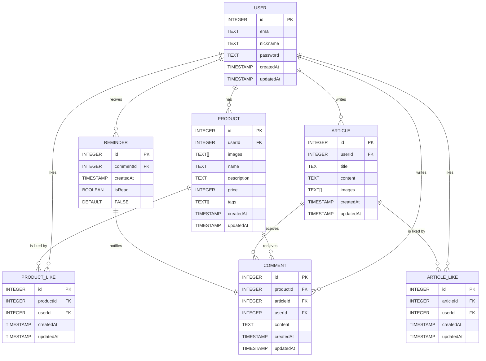

```mermaid
erDiagram

USER {
INTEGER id PK
TEXT email
TEXT nickname
TEXT password
TIMESTAMP createdAt
TIMESTAMP updatedAt
}

PRODUCT{
INTEGER id PK
INTEGER userId FK
TEXT[] images
TEXT name
TEXT description
INTEGER price
TEXT[] tags
TIMESTAMP createdAt
TIMESTAMP updatedAt
}

ARTICLE{
INTEGER id PK
INTEGER userId FK
TEXT title
TEXT content
TEXT[] images
TIMESTAMP createdAt
TIMESTAMP updatedAt
}

COMMENT{
  INTEGER id PK
  INTEGER productId FK
  INTEGER articleId FK
  INTEGER userId FK
  TEXT content
  TIMESTAMP createdAt
  TIMESTAMP updatedAt
}

PRODUCT_LIKE{
 INTEGER id PK
 INTEGER productId FK
 INTEGER userId FK
 TIMESTAMP createdAt
 TIMESTAMP updatedAt
}

ARTICLE_LIKE{
 INTEGER id PK
 INTEGER articleId FK
 INTEGER userId FK
 TIMESTAMP createdAt
 TIMESTAMP updatedAt
}

REMINDER {
INTEGER id PK
INTEGER commentId FK
TIMESTAMP createdAt
BOOLEAN isRead DEFAULT FALSE
}

USER ||--o{ PRODUCT :has
USER ||--o{ ARTICLE :writes
USER ||--o{ COMMENT :writes
PRODUCT ||--o{ COMMENT :receives
ARTICLE ||--o{ COMMENT :receives
USER  ||--o{ PRODUCT_LIKE :likes
PRODUCT ||--o{ PRODUCT_LIKE :"is liked by"
USER  ||--o{ ARTICLE_LIKE :likes
ARTICLE ||--o{ ARTICLE_LIKE :"is liked by"
REMINDER ||--|| COMMENT :notifies
USER  ||--o{ REMINDER :recives
```
